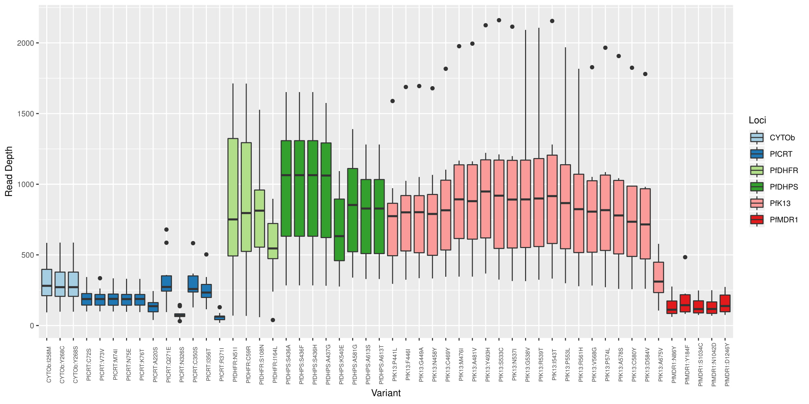
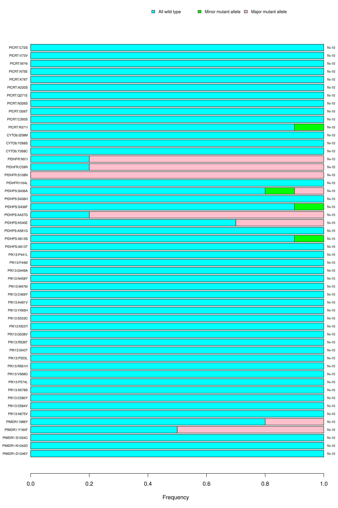
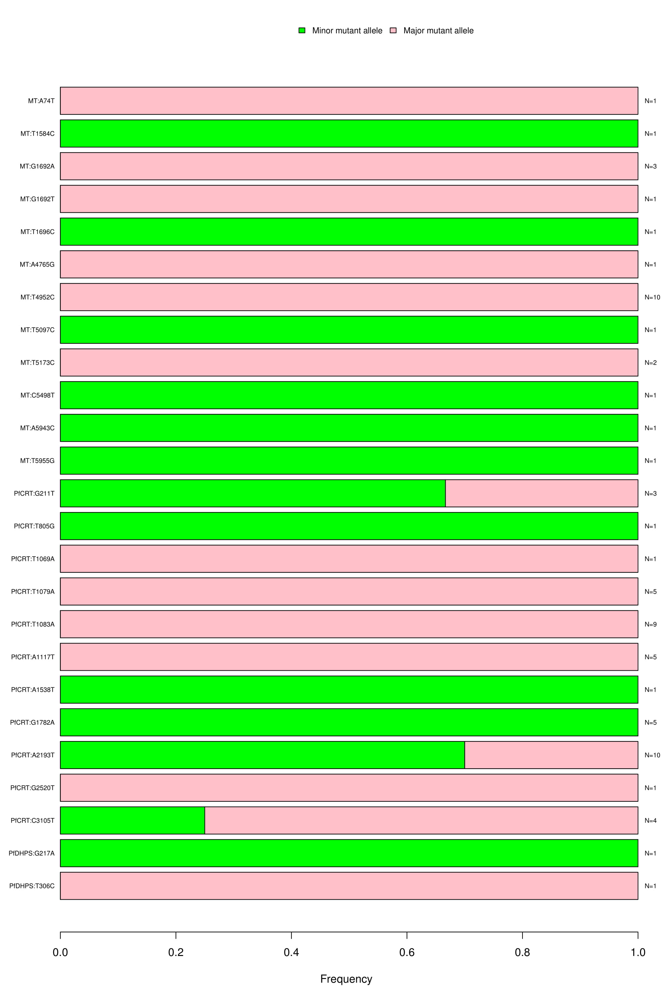
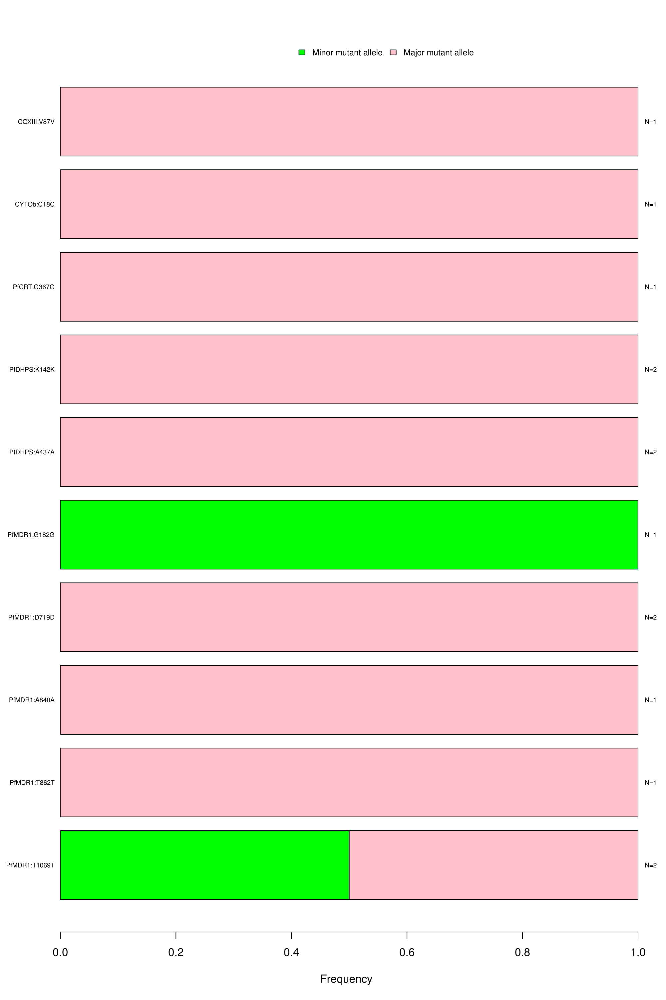
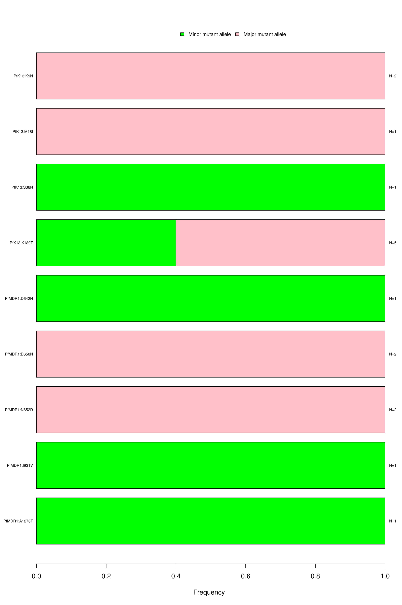

# Next-generation Sequence-analysis Toolkit (NeST) : A standardized bioinformatics framework for analyzing SNPs in next-generation sequencing data

Advancements in next-generation sequencing have led to the development of numerous bioinformatics tools and pipelines. Current tools for variant calling offer high-quality solutions; however, many tools are tailored for model organisms. Here, we present NeST, a consensus-based variant calling tool with a plug-and-play framework for use with any organism with minimal user input. NeST consists of four modules, integrating open-source bioinformatics tools and a custom VCF parser, to generate high-quality consensus variant calls. NeST was validated using targeted-amplicon deep sequencing data from 245 Plasmodium falciparum isolates to identify single-nucleotide polymorphisms conferring drug resistance. NeST offers a light-weight pipeline for variant calling with standardized outputs and minimal computational demands for easy deployment for use with various organisms and applications. The following document outlines details of installation, results from MaRS dataset and usage of individual modules for analysis.

1. [Overview of NeST framework](#Overview)
2. [Availability of code and installation](#Installation)
3. [Your first analysis](#First)
4. [Input standardization](#inputs)
5. [Output description](#output)

<a id="Overview"></a>
## Overview of the NeST framework:

NeST is a python based modular framework for consensus based variant calling. The overall analysis framework is broken down into four major blocks.
1. PrepInputs
2. VarCallEngine
3. VCFToolkit
4. Summarize


The figure outlines the four key blocks of NeST and the steps performed by each step. VarCallEngine and VCFToolkit are spawned in parallel for each sample that is being analyzed in the study. By default, 4 parallel threads are spawned, to account for minimum available computational resource. This can be altered as per availability of resources.

<a id="Installation"></a>
## Availability of code and installation:

1. Download git repository:

   Clone the master branch of this repository.
   ```
   git clone https://github.com/shashidhar22/NeST
   ```

2. Installation:

   NeST comes with a install script that can be run to setup miniconda and create the virtual environment required to run NeST. To setup up miniconda and the NeST virtual environment, run the following command from the NeST directory. **If you already have Anaconda or Miniconda installed on your system, you can skip the install step and just create a new environment as described in the next codeblock**

   ```
   cd  NeST
   ./install.sh
   ```

   To check if you have conda installed on your system you can use the following command

   ```
   conda --version
   ```

   To create the NeST environment, run the following command from the NeST directory.

   ```
   conda env create -n nest -f lib/nest_env.yaml
   ```


   Once the environment is created you will need to refresh your `.bashrc` or `.bash_profile` using the following command

   ```
   #If you have a .bashrc file
   source ~/.bashrc
   #If you have a .bash_profile file
   source ~/.bash_profile
   ```
   The `nest` virtual environment  can then be activated using the command.

   ```
   conda activate nest
   ```

   To deactivate the environment just type.

   ```
   conda deactivate
   ```

   Note: NeST virtual environment currently uses `bioconda` and `conda-forge` channels. There are known conflicts with the conda `defaults` channel and `conda-forge` channel, which can lead to errors in creation of the environment. To overcome the issue, the NeST environment ignores the `defaults` channel. If you plan to modify the NeST environment, please update the configuration file provided or make sure to ignore the `defaults` channel.

   If you are running into issues with multiple versions of conda. You can uninstall the version of conda that you prefer by just deleting the miniconda folder (for example)

   ```
   rm -rf ~/miniconda
   ```
   and editing removing the following line from your `.bashrc` or `.bash_profile`

   ```
   . <path to home directory>/miniconda/etc/profile.d/conda.sh
   ```

   Will delete the version of miniconda installed by NeST. **Note: if you delete a miniconda installation you will lose all the environments associated with that installation of conda**

<a id="First"></a>
## Your first analysis

   NeST was conceptualized to identify mutations that confer anti-malarial drug resistance in *P.falciparum* (Talundzic et al., 2018). It was also applied for the detection of antibiotic drug resistance in *M.tubercolosis* (Colman et al., 2015). To make it easier to recreate these studies, we have included script to execute NeST on these two datasets.

   1. MaRS on NeST:

      To re-create the MaRS study (Talundzic et al., 2018), run the following command from the NeST directory.

      ```
      ./runPF.sh
      ```

      This downloads 10 sample fastq files from the [MaRS bioproject]((https://www.ncbi.nlm.nih.gov/bioproject/?term=PRJNA428490) and executes NeST on the samples. The results are stored under `local/MaRS_test` folder within the NeST directory. The 10 target amplicon sequencing datasets, serve as a perfect test case for NeST and the analysis should take about 10 minutes on any laptop*.

      *\*Depending on internet speed*

   2. Detecting mutations conferring drug resistance in *M.tuberculosis* clinical samples from Colman et al., 2015:

      To re-create the analysis from Colman et al., 2015, run the following command from the NeST directory.

      ```
      ./runTB.sh
      ```

      This will download 57 paired fastq files from the bioproject [PRJNA271805](https://www.ncbi.nlm.nih.gov/bioproject/PRJNA271805), merges the different runs and executes NeST on the clinical samples from the paper. The results are stored under `local/ColmanEtAl` folder within the NeST directory. This analysis takes significantly longer than the MaRS study and requires around 80GB of disk space, due to the large amount of data that is download. Make sure you have a good internet connection and adequate amount of coffee before starting this study.

   3. Executing NeST on a HPC framework:

      An early implementation of HPC enabled NeST is available with the [NeSTv2.1.0 branch](https://github.com/shashidhar22/NeST/tree/v2.1.0#hpc). The script ```nest_submitter.py``` generates and submits a job in a Moab scheduler environment. It is still a work in progress and users need to manipulate the nest_submitter.py to reflect the HPC enivronment specifications. The command listed below will spawn 101 jobs for all the 10105 samples from [(The CRyPTIC Consortium and the 100, 2018)](https://www.nejm.org/doi/full/10.1056/NEJMoa1800474) paper, using 1 node per job, with 15 threads and 16gb of memory per threads. Since this is still a work in progress, please use make necessary changes to the submitter script or create an issue on the GitHub branch with your HPC framework details and we will get back to you with the changes needed to execute NeST on your HPC framework.

      The average wall time for 101 jobs was 3.84 hours. The ability to split samples and schedule parallel jobs, drastically reduces the turn around time for any analysis. The results for each of the 101 jobs can be downloaded from http://vannberg.biology.gatech.edu/data/NEJM_results.tar.gz

      The variant calls from the NeST for the *rpoB* were extracted and compiled to label each of the samples from CRyPTIC Consortium study as resistant or susceptible to Rifampicin, based on the list of variants associated with Rifampicin resistance provide by the [(The CRyPTIC Consortium and the 100, 2018)](https://www.nejm.org/doi/full/10.1056/NEJMoa1800474) (Also refer Jupyter notebook with the CRyPTIC folder). The predictions from NeST were then compared to that of the genotype calls from the CRyPTIC Consortium and the phenotypic information also provided for the samples.

      The precision and recall for the comparison is shown in the table below. It is to be noted that NeST as of the current version only calls SNPs and hence InDels associated with Rifampicin resistance were not considered in predicting the genotypes. This feature however will be implemented in the coming releases of NeST.

      |           Comparison            | Prediction Label  |  Precision   | Recall | F1-score | Support |
      |:-------------------------------:|:-----------------:|:------------:|:------:|:--------:|:-------:|
      | NeST Prediction vs Phenotype    |  Resistant        |     0.97     | 0.91   |  0.94    |  2557   |
      |                                 |  Susceptible      |     0.86     | 0.95   |  0.90    |  1403   |
      | CRyPTIC Prediction vs Phenotype |  Resistant        |     0.97     | 1.00   |  0.98    |  2557   |
      |                                 |  Susceptible      |     0.99     | 0.94   |  0.97    |  1403   |


      This research was supported in part through research cyberinfrastructure resources and services provided by the Partnership for an Advanced Computing Environment (PACE) at the Georgia Institute of Technology, Atlanta, Georgia, USA.


   4. Executing your own analysis using NeST:

      NeST can be executed on your own dataset using the following command:

      ```
      python3 nest.py -i <path to input directory/ sra accession list> -a <adapter fasta file> -r < reference fasta file> -b < reference bed file> -o <output directory path> --varofint <CSV file with variants of interest>
      ```

      NeST can be run without a variant of interest file, but it will not produce any summary figures. To get a list of options that can be used with NeST just type

      ```
      python3 nest.py -h
      ```

      The details about the required input formats are listed in the next section.

<a id="inputs"></a>
## Input standardization:

NeST is designed to reduce the amount of user intervention with regards to inputs that the user needs to provide. However to enable standardization of inputs across all organisms we require that a particular file format be followed for the three inputs listed below:

1. Fastq files:

   The PrepInputs module in NeST highly simplifies the management of fastq files. The module accepts two input formats.
   1. Input directory path:

      This just requires the user to provide the path to a folder containing fastq files. The files are recognized by the file extension, so the files must have either ```fq```, ```fq.gz```, ```fastq``` or ```fastq.gz``` file extensions. The name convention of paired file can be ```_1```, ```_r1```, or ```_R1```.

   2. SRA accession list:

      This list requires a ```.txt``` with a list of SRA experiments, with one SRA number per line. This can be export from the SRA run selector tool.
      An example SRA accession is provided under ```fq/MaRS_test/SRA_Acc_list.txt```.

2. BED format:

   The BED (Browser Extensible Data) is an easy and lightweight format to list annotations for a genome. NeST uses a full BED or BED 12 column format file as a guide to annotate variants with codon and amino acid changes. The example file listed below shows the details of how to structure the BED file. The separation of contig, gene and exon level information makes this format highly portable across genomes. The BED 12 column format for most organisms can be export from the [UCSC table browser](https://genome.ucsc.edu/cgi-bin/hgTables). A detail explanation of the BED format can be found [here](https://genome.ucsc.edu/FAQ/FAQformat.html#format1)

   ```
   #contig start stop gene score strand  CDSstart  CDSstop rbg NoOfExons ExonLengths ExonStarts
   PfCRT 1	3399	PfCRT	.	+	95	3191	0	13	90,268,172,132,71,75,82,50,56,92,44,54,76,	96,364,812,1157,1443,1638,1810,2020,2208,2413,2699,2891,3115,
   MT	1	5967	COXIII	.	-	734	1573	0	1	839,	734,
   MT	1	5967	COL	.	+	1933	3471	0	1	1538,	1933,
   MT	1	5967	CYTOb	.	+	3492	4622	0	1	1130,	3492,
   PfDHFR	1	1827	PfDHFR	.	+	1	1827	0	1	1827,	1,
   PfDHPS	1	2417	PfDHPS	.	+	1	2417	0	3	135,1868,115,	1,313,2302,
   PfK13	1	2181	PfK13	.	+	1	2181	0	1	2181,	1,
   PfMDR1	1	4260	PfMDR1	.	+	1	4260	0	1	4260,	1,
   ```

3. Variant of Interest:

   The Summarize module within NeST, allows for easy summarization of variants called from all samples in a study. If a user specifies a list of variants of interest, a separate table will be created for these set of variants. The variants can be specified in ```.tsv```, ```.csv```, ```.xlsx``` format. And follows the format listed below

   | Chrom  | Gene   | RefAA | AAPos | AltAA |
   |:------:|:------:|:-----:|:-----:|:-----:|
   | PfCRT  | PfCRT  |   C   |   72  |   S   |
   | PfCRT  | PfCRT  |   V   |   73  |   V   |
   | PfMDR1 | PfMDR1 |   N   |   86  |   Y   |
   | PfMDR1 | PfMDR1 |   Y   |   184 |   F   |
   | MT     | CYTOb  |   I   |   258 |   M   |


<a id="output"></a>
## Output Description

1. Report files:

   NeST produces table reports that summarize the different types of variants found in the sample. All the tables will be stored under the ```Reports``` folder inside the output directory. The table below describes the different files that are generated by NeST.

   |                   File                    |                                          Description                                                                                                      |
   |:------------------------------------------|:----------------------------------------------------------------------------------------------------------------------------------------------------------|
   | Study_known_variants.csv                  | This file contains the calls for each of the variants of interst, for each of the samples. The table also lists the variant call metrics for the variants |
   | Study_known_variants_allele_frequency.csv | This file lists the allele frequency for each of the variants of interest, for each of the samples in the study                                           |
   | Study_known_variants_depth.csv            | This file lists the depth for each of the variants of interest, for each of the samples in the study                                                      |
   | Study_novel_exonic_variants.csv           | This files lists all the novel exonic variants found in all the samples in the study along with the variant call metrics                                  |
   | Study_novel_intronic_variants.csv         | This files lists all intronic variants found in all the samples in the study along with the variant call metrics                                          |
   | Study_novel_variants_allele_frequency.csv | This files lists the allele frequency for each of the novel variants, for each of the samples in the study                                                |
   | Study_novel_variants_depth.csv            | This files lists the depth for each of the novel variants, for each of the samples in the study                                                           |
   | Study_variants.json                       | JSON file with sample meta information and variant calls for the all samples in the study                                                                 |


2. Figure files:

   NeST produces summarization figures which are stored under ```Figures``` folder inside the output directory. The figures generated are listed below.

    * Study Depth:

      Read depth of coverage for single nucleotide polymorphisms (SNPs) associated with malaria drug resistance. SNP loci are shown on the x axis, and the read depth of coverage on the y axis. The colors indicate the genes that were amplified during sequencing.

      

    * Reportable SNPs:

      Bar graph depicting the wild type, major and minor allele frequencies of associated and/or confirmed resistance SNPs. Allele frequencies are indicated on the x axis, and the variants of interest are listed along the y-axis (left). The number of samples that had a particular mutation is indicated on the y-axis (right). The color coding indicates the type of mutation found in the samples; blue is for wild type, green for minor allele mutation and red for major allele mutation.

      

    * Novel Intronic SNPs:

      Bar graph depicting the wild type, major and minor allele frequencies of intronic SNPs. Allele frequencies are indicated on the x axis, and the variants of interest are listed along the y-axis (left). The number of samples that had a particular mutation is indicated on the y-axis (right). The color coding indicates the type of mutation found in the samples; blue is for wild type, green for minor allele mutation and red for major allele mutation.

      

    * Novel synonymous exoniic SNPs:

      Bar graph depicting the wild type, major and minor allele frequencies of novel synonymous SNPs. Allele frequencies are indicated on the x axis, and the variants of interest are listed along the y-axis (left). The number of samples that had a particular mutation is indicated on the y-axis (right). The color coding indicates the type of mutation found in the samples; blue is for wild type, green for minor allele mutation and red for major allele mutation.

      

    * Novel non-synonymous exonic SNPs:

      Bar graph depicting the wild type, major and minor allele frequencies of novel non-synonymous SNPs. Allele frequencies are indicated on the x axis, and the variants of interest are listed along the y-axis (left). The number of samples that had a particular mutation is indicated on the y-axis (right). The color coding indicates the type of mutation found in the samples; blue is for wild type, green for minor allele mutation and red for major allele mutation.

      
