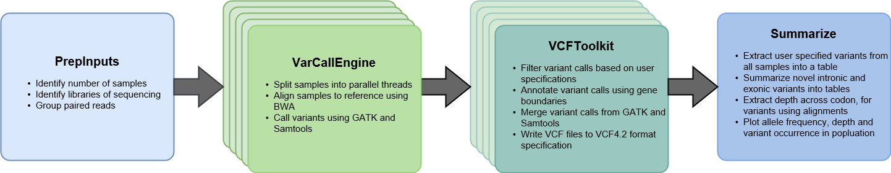

# Next-generation Sequence-analysis Toolkit (NeST) : A standardized bioinformatics framework for analyzing SNPs in next-generation sequencing data

Advancements in next-generation sequencing have led to the development of numerous bioinformatics tools and pipelines. Current tools for variant calling offer high-quality solutions; however, many tools are tailored for model organisms. Here, we present NeST, a consensus-based variant calling tool with a plug-and-play framework for use with any organism with minimal user input. NeST consists of four modules, integrating open-source bioinformatics tools and a custom VCF parser, to generate high-quality consensus variant calls. NeST was validated using targeted-amplicon deep sequencing data from 245 Plasmodium falciparum isolates to identify single-nucleotide polymorphisms conferring drug resistance. NeST offers a light-weight pipeline for variant calling with standardized outputs and minimal computational demands for easy deployment for use with various organisms and applications. The following document outlines details of installation, results from MaRS dataset and usage of individual modules for analysis.

1. [Overview of NeST framework](#Overview)
2. [Availability of code and installation](#Installation)
3. [NeST for Malaria Resistance Surveillance(MaRS)](#MaRS)
4. [Input standardization](#inputs)
5. [NeST class structure](#classes)

<a id="Overview"></a>
## Overview of the NeST framework:

NeST is a python based modular framework for consensus based variant calling. The overall analysis framework is broken down into four major blocks.
1. PrepInputs
2. VarCallEngine
3. VCFToolkit
4. Summarize



The figure outlines the four key blocks of NeST and the steps performed by each step. VarCallEngine and VCFToolkit are spawned in parallel for each sample that is being analyzed in the study. By default, 4 parallel threads are spawned, to account for minimum available computational resource. This can be altered as per availability of resources.

<a id="Installation"></a>
## Availability of code and installation:

1. Download git repository:

   Clone the master branch of this repository.
   ```
   git clone https://github.com/shashidhar22/NeST
   ```

2. Installing perquisites for Conda:R
   NeST requires [Python3](https://www.python.org/downloads/) to be installed with [Pip](https://pip.pypa.io/en/stable/installing/) available. Please make sure this is available on the system. To setup your runtime environment, we recommend using conda, the perquisites for conda can be installed using the following command

   ```
   python3 -m pip install pycosat pyyaml requests --user
   ```

3. Installing MiniConda and downloading third party libraries:

   NeST uses many Python and R modules along with standard bioinformatics tools for the analysis pipeline. To ensure easy installation and versioning of these tools, we using MiniConda package manager. The following steps detail the installation of MiniConda and the listed tools.

     1. Installing MiniConda:
        If you do not have MiniConda or Anaconda installed already, follow the steps below to setup the MiniConda environment.

        ```
        sh lib/Miniconda3-latest-Linux-x86_64.sh
        ```

        Press ```ENTER``` when prompted, when asked for installation path, type yes and press ```ENTER``` to use your ```HOME``` folder as the site of  installation or enter path to the folder where you want Miniconda3 to be installed. When asked if you want to add Miniconda3 to your ```.bashrc```, type yes and press ```ENTER```, this will just add Miniconda3 to your ```PATH```.

        Source your ```.bashrc```, to ensure that MiniConda gets loaded. To verify your installation, type the following command

        ```
        source ~/.bashrc
        conda list
        ```

        This will display the list of installed packages in the MiniConda environment.
        Update conda after installation and install anaconda client to allow the use of R packages in conda environment

        ```
        conda update conda
        conda install anaconda-client anaconda-build conda-build
        ```

     2. Loading conda environment:

        Loading the ```kookaburra_env.yaml``` from the ```lib``` folder will install all the required tools for NeST into a conda environment

        ```
        conda env create -n kook_env --file lib/kookaburra_env.yaml
        source activate kook_env
        gatk-register lib/GenomeAnalysisTK.jar
        ```

     3. Deactivate conda environment:
        Once the analysis is complete you can exit from the NeST environment by typing the following command:

        ```
        source deactivate kook_env
        ```

        To perform another analysis with NeST you will activate the kook_env environment.

4. Your first analysis:

   NeST comes packaged with an SRA accession list from the [MaRS]((https://www.ncbi.nlm.nih.gov/bioproject/?term=PRJNA428490) experiment. The includes the SRA accession for 10 Illumina paired end samples. Running the command listed below, will download the 10 samples using [SRAToolkit](https://trace.ncbi.nlm.nih.gov/Traces/sra/sra.cgi?view=software) and run NeST on it.

   ```
   sh run.sh fq/MaRS_test/SRR_Acc_List.txt local/MaRs_test
   ```

   To run NeST on locally stored fastq files. You can just provide the path to the input directory instead of the accession list.
   For example if you have stored your fastq files in ```fq/``` folder and you want to store the results in the folder ```local/```. You can run the following command from the NeST directory.

   ```
   sh run.sh fq/ local/
   ```

<a id="MaRS"></a>
## NeST for Malaria Resistance Surveillance(MaRS):

Coming soon

<a id="inputs"></a>
## Input standardization:

NeST is designed to reduce the amount of user intervention with regards to inputs that the user needs to provide. However to enable standardization of inputs across all organisms we require that a particular file format be followed for the three inputs listed below:

1. Fastq files:

   The PrepInputs module in NeST highly simplifies the management of fastq files. The module accepts two input formats.
   1. Input directory path:

      This just requires the user to provide the path to a folder containing fastq files. The files are recognized by the file extension, so the files must have either ```fq```, ```fq.gz```, ```fastq``` or ```fastq.gz``` file extensions. The name convention of paired file can be ```_1```, ```_r1```, or ```_R1```.

   2. SRA accession list:

      This list requires a ```.txt``` with a list of SRA experiments, with one SRA number per line. This can be export from the SRA run selector tool.
      An example SRA accession is provided under ```fq/MaRS_test/SRA_Acc_list.txt```.

2. BED format:

   The BED (Browser Extensible Data) is an easy and lightweight format to list annotations for a genome. NeST uses a full BED or BED 12 column format file as a guide to annotate variants with codon and amino acid changes. The example file listed below shows the details of how to structure the BED file. The separation of contig, gene and exon level information makes this format highly portable across genomes. The BED 12 column format for most organisms can be export from the [UCSC table browser](https://genome.ucsc.edu/cgi-bin/hgTables). A detail explanation of the BED format can be found [here](https://genome.ucsc.edu/FAQ/FAQformat.html#format1)

   ```
   #contig start stop gene score strand  CDSstart  CDSstop rbg NoOfExons ExonLengths ExonStarts
   PfCRT 1	3399	PfCRT	.	+	95	3191	0	13	90,268,172,132,71,75,82,50,56,92,44,54,76,	96,364,812,1157,1443,1638,1810,2020,2208,2413,2699,2891,3115,
   MT	1	5967	COXIII	.	-	734	1573	0	1	839,	734,
   MT	1	5967	COL	.	+	1933	3471	0	1	1538,	1933,
   MT	1	5967	CYTOb	.	+	3492	4622	0	1	1130,	3492,
   PfDHFR	1	1827	PfDHFR	.	+	1	1827	0	1	1827,	1,
   PfDHPS	1	2417	PfDHPS	.	+	1	2417	0	3	135,1868,115,	1,313,2302,
   PfK13	1	2181	PfK13	.	+	1	2181	0	1	2181,	1,
   PfMDR1	1	4260	PfMDR1	.	+	1	4260	0	1	4260,	1,
   ```

3. Variant of Interest:

   The Summarize module within NeST, allows for easy summarization of variants called from all samples in a study. If a user specifies a list of variants of interest, a separate table will be created for these set of variants. The variants can be specified in ```.tsv```, ```.csv```, ```.xlsx``` format. And follows the format listed below

   | Chrom  | Gene   | RefAA | AAPos | AltAA |
   |:------:|:------:|:-----:|:-----:|:-----:|
   | PfCRT  | PfCRT  |   C   |   72  |   S   |
   | PfCRT  | PfCRT  |   V   |   73  |   V   |
   | PfMDR1 | PfMDR1 |   N   |   86  |   Y   |
   | PfMDR1 | PfMDR1 |   Y   |   184 |   F   |
   | MT     | CYTOb  |   I   |   258 |   M   |
